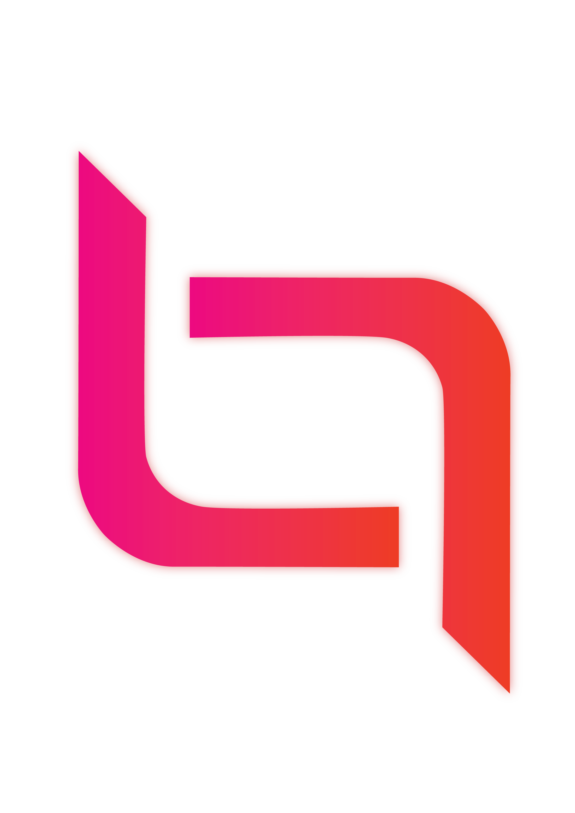

# HuTouch

HuTouch - Production Grade Flutter AI code for UI, API, Business logic in mins.

HuTouch - Production Grade Flutter AI code for UI, API, Business logic in mins.

If you are looking for an extension and thinking:
- "Will this generate production-grade Flutter code, or more demo snippets?"
- "Does it follow clean architecture and real state management, or invent its own style?"
- "Is this actually better than what I get from Cursor/Copilot?"

HuTouch is built for exactly those questions and it does all of it without vibe coding.

### What Flutter Devs are saying
- "The quality of code from HuTouch is 10x better than Cursor/Copilot, and I did not have to build instructions from scratch."

HuTouch uses community-driven, tried and tested or your preferred coding standards as its backbone:
- Clean Architecture patterns common in real apps (OOPS, SOLID)
- Proper state management (Bloc, Riverpod, Provider, GetX)
- Reusable components and files
- Standards/naming that feel familiar in most Flutter teams (adaptability, localization, error handling, and other coding standards)

So instead of AI-flavored code, you get code that looks like someone experienced joined your project.

### FAQs

**Q: Will HuTouch generate production-grade Flutter code?**  
A: Yes. Our whole design is around production-grade standards, not toy examples. Code is generated around:
- Clear layering (UI, domain, data)
- Real-world state handling
- Maintainable widget trees and reusable components

**Q: Do I need to handcraft a giant instruction file?**  
A: No. HuTouch leans on:
- Community driven tried and tested coding standards (Flutter devs collective experience)
- Your preferred coding standards by looking at the context of your existing project (imported via the extension and desktop app)

You do not start from a blank prompt spec. You start from your project plus shared best practices.

**Q: What about effort? Does this actually save me time?**  
A: Yes. Our target is to save you more than 40% coding effort by automating the boring parts and compress:
- About eight hours of screen work into minutes in roughly five to seven clicks.

### How HuTouch Works

1. Open your Flutter project with the HuTouch extension installed.
2. Start the HuTouch desktop app.
3. HuTouch reads your project structure and code (read-only) and identifies your preferred coding standards.
4. You tell HuTouch what you are building:
   - Provide the Figma URL and UI name that you use for your project or a screenshot of the UI you would like to build.
   - Upload a functional requirements document or allow HuTouch to generate requirements for you based on your UI.
   - Confirm your preferred coding standards and allow HuTouch to generate code.
5. You review the generated code and merge it like you would review a PR.

You do not micro-manage the AI; you verify if it matches the standards you already care about.  
Here is a short demo of how production grade UI/API/Business logic is built using HuTouch:  
https://youtu.be/sxYFHtkNN0Q

### Integrations

Even though this version emphasizes quality, you still get all the workflow benefits:
- Figma to Flutter UI: screens become production-ready widget trees following your architecture.
- Postman to API code: clients, models, services wired into existing patterns.
- Requirements docs to logic: validation, flows, naming pulled into the code.

The point is not just automation; it is automation that does not trash your standards.

### HuTouch Extension + HuTouch Desktop App (Important)

To use HuTouch fully, you will need the HuTouch desktop app (https://hutouch.com/download) alongside this extension.

We know that:
- Installing another app is extra work.
- You would prefer a simple "install extension -> magic" experience.

We are genuinely sorry for that friction and plan to enhance the extension further, but we chose this design because:
- The desktop app can handle multi-agent reasoning and tool integrations (Figma, Postman, docs) safely.
- The extension stays lightweight, stable, and focused on project integration.

We are very grateful you are willing to take that extra step. Our promise is simple: we want the first few features you build to feel like a clear upgrade in code quality, not just speed.

### Demos

- Figma to Production Grade Flutter Code: https://youtu.be/sxYFHtkNN0Q
- API Integration: https://youtu.be/UIkyMpWmemo
- Modify Code/Fix bugs/New or update business logic: https://youtu.be/tvEqfNOBbqY
- HuTouch Blueprints, aka community driven tried and tested coding standards: https://youtu.be/jxmO-HogLas
- Review generated code and merge: https://youtu.be/NpTtt_MZwv8

### Requirements

- Visual Studio Code 1.89.0+
- HuTouch desktop app (Windows)
- Existing Flutter project/Figma/APIs and no vibe coding :)

---

## FIGMA – Production-grade code, community standards

Mindset: "I want Figma to Flutter, but only if devs get code they actually trust."

### Long Description

HuTouch - Figma to Production Grade Flutter Code With Tried and Tested Community Coding Standards.

For teams asking:
- "Can we get Flutter code directly from Figma that devs actually trust?"
- "Will the generated code follow clean architecture and real state management?"
- "Is this better than just throwing the design/screenshot at Cursor / Copilot and hoping for the best?"

HuTouch is a Figma to Flutter extension that connects your designs to a multi-agent AI coder focused on production-grade output.

### What Flutter Devs are saying

- "The quality of code from HuTouch is 10x better than Cursor/Copilot, and I did not have to build instructions from scratch."

HuTouch uses community-driven, tried and tested or your preferred coding standards as its backbone:
- Clean Architecture patterns common in real apps (OOPS, SOLID)
- Proper state management (Bloc, Riverpod, Provider, GetX)
- Reusable components and files
- Standards/naming that feel familiar in most Flutter teams (adaptability, localization, error handling, and other coding standards)

Designers get a smooth Figma workflow. Developers get code that feels like a senior Flutter dev wrote it.

### FAQs

**Q: Will the code be production-grade, or just a starter snippet?**  
A: HuTouch aims for production-grade code by default:
- Layered UI/domain/data structure
- Real widget hierarchies, not auto-layout spaghetti
- State and navigation wired the way devs expect in modern Flutter apps

**Q: Do we need a giant prompt or instructions file to get good results?**  
A: No. HuTouch combines:
- Community-driven tried and tested or your preferred coding standards as a baseline
- The context from your Figma file (naming, components, constraints)
- The context from your Flutter project (through the HuTouch desktop app)

You do not start from a blank prompt. You start from your design plus code plus shared standards.

**Q: What about effort savings?**  
A: The goal is to save more than 40% effort by automating the boring parts of coding and compress:
- An eight-hour screen into minutes and about five to seven clicks
- Without sacrificing quality.

### How the extension fits your workflow

1. In Figma, select the frames or components you want as Flutter screens.
2. Run HuTouch from the Extensions menu.
3. HuTouch bundles the right metadata (names, hierarchy, constraints).
4. In the HuTouch desktop app:
   - Confirm the UI name.
   - Upload requirements specs or allow HuTouch to generate it for the provided UI name.
   - Confirm HuTouch Blueprint (coding standards, clean architecture, state management).
5. Your Flutter project specs plus these Figma specs are used to generate:
   - Clean, production-ready Flutter UI.
   - Code aligned with community based tried and tested or your preferred standards.

### HuTouch Extension + HuTouch Desktop App (Important)

To use HuTouch fully, you will need the HuTouch desktop app (https://hutouch.com/download) alongside this extension.

We know that:
- Installing another app is extra work.
- You would prefer a simple "install extension -> magic" experience.

We are genuinely sorry for that friction and plan to enhance the extension further, but we chose this design because:
- The desktop app can handle multi-agent reasoning and tool integrations (Figma, Postman, docs) safely.
- The extension stays lightweight, stable, and focused on design-to-code export.

We are very grateful you are willing to take that extra step. Our promise is simple: we want the first few features you build to feel like a clear upgrade in code quality, not just speed.

### Demos

- Figma to Production Grade Flutter Code: https://youtu.be/sxYFHtkNN0Q
- API Integration: https://youtu.be/UIkyMpWmemo
- Modify Code/Fix bugs/New or update business logic: https://youtu.be/tvEqfNOBbqY
- HuTouch Blueprints, aka community driven tried and tested coding standards: https://youtu.be/jxmO-HogLas
- Review generated code and merge: https://youtu.be/NpTtt_MZwv8